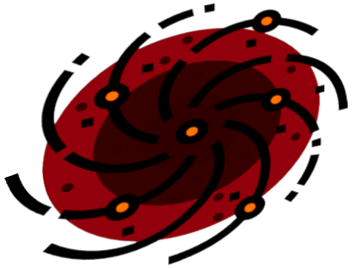

# Nebbish

A golf language. Better documentation coming soon.

## Nebbish Commands

### Arithmetic
| Instruction | Name        |
|-------------|-------------|
| `+`         | Add         |
| `-`         | Subtract    |
| `*`         | Multiply    |
| `/`         | Divide      |
| `^`         | Power       |
| `%`         | Mod         |

### Stack
| Instruction | Name         |
|-------------|--------------|
| `:`         | Dup          |
| `~`         | Swap         |
| `;`         | Drop         |
| `I`         | Intangibilize|
| `T`         | Tangibilize  |

### List
| Instruction | Name         |
|-------------|--------------|
| `a`         | Append       |
| `c`         | Concat       |
| `l`         | Length       |
| `L`         | Listify      |
| `s`         | Sum          |
| `S`         | Sort         |

### String
| Instruction | Name        |
|-------------|-------------|
| `"`         | String mode  |
| `` ` ``     | Command mode  |

### Loop
| Instruction | Name         |
|-------------|--------------|
| `m`         | Mark         |
| `j`         | Jump         |
| `b`         | Break if     |

### Comparison
| Instruction | Name         |
|-------------|--------------|
| `=`         | Equal        |
| `>`         | Greater than |
| `<`         | Less than    |

### Register
| Instruction | Name         |
|-------------|--------------|
| `x`         | Copy X       |
| `X`         | Move to X    |
| `y`         | Copy Y       |
| `Y`         | Move to Y    |

### Output
| Instruction | Name         |
|-------------|--------------|
| `p`         | Print        |
| `P`         | Prettyprint  |

### Miscellaneous
| Instruction | Name         |
|-------------|--------------|
| `d`         | Dump         |
| `#`         | Join Ints    |
| `i`         | Context      |

More to come soon!
